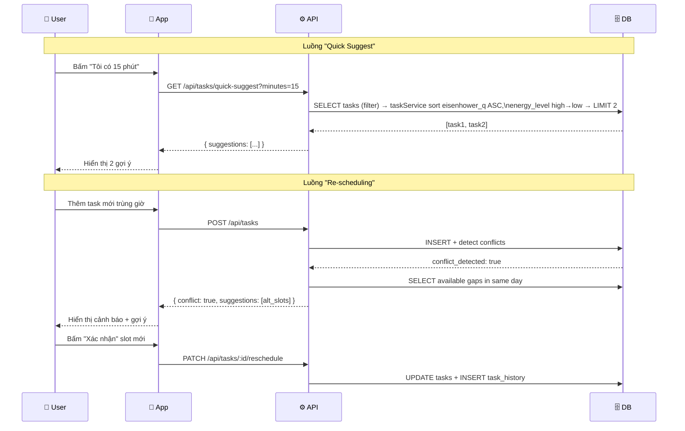

# ARCHITECTURE.md — Kiến trúc Hệ thống

> **Dự án:** Focus Flow  
> **Người viết:** Senior Tech Lead  
> **Nguyên tắc thiết kế:** Managed services ưu tiên, Scalable by default, Security first

---

## 1. Tech Stack

### Lựa chọn & Lý do Kỹ thuật

| Layer | Công nghệ | Lý do |
|---|---|---|
| **Frontend** | React Native (Expo) | Một codebase cho iOS + Android; Expo managed workflow giảm thiểu DevOps overhead cho team nhỏ |
| **Backend API** | Node.js + Fastify | Fastify nhanh hơn Express ~2x; schema validation built-in giảm lỗi runtime |
| **Database** | PostgreSQL (via Supabase) | Managed service, built-in Auth, Row Level Security (RLS) native — tránh technical debt về phân quyền |
| **Auth** | Supabase Auth (JWT) | Managed, hỗ trợ OAuth2 (Google/Apple), tránh tự implement auth — nguồn gốc của 80% lỗ hổng bảo mật |
| **Background Jobs** | Supabase Edge Functions + pg_cron | Serverless, không cần quản lý server riêng cho cron jobs (morning plan, energy reset) |
| **Push Notification** | Expo Push Notifications + FCM/APNs | Expo abstract hóa sự phức tạp của FCM/APNs; single API cho cả 2 platform |
| **Logging & Monitoring** | Sentry (Error) + Supabase Analytics | Sentry cho error tracking với stack trace; tách biệt error log khỏi application log |
| **CI/CD** | GitHub Actions | Native với GitHub; free tier đủ dùng cho team nhỏ |
| **Deployment** | Railway (API) + Vercel (nếu có web) | Managed PaaS, auto-scaling, zero-downtime deploy |

> **Lý do ưu tiên Managed Services:**  
> Team nhỏ (2–5 người) không nên tốn effort vận hành infrastructure. Mỗi giờ cấu hình server là một giờ không xây feature. Managed services chuyển operational risk sang vendor, cho phép focus vào business logic.

---

## 1.1 API Service Layer

Service pattern trong `apps/api/services/`. Mỗi request dùng Supabase client gắn JWT user (anon key + `Authorization` header) — **không** dùng service role key cho luồng đọc task của user.

### `taskService.getQuickSuggest(userId, minutes)` — PB_4

| Bước | Mô tả |
|---|---|
| Lọc | `estimated_min ≤ minutes`, `status IN ('todo','in_progress')`, `deleted_at IS NULL`, `user_id` khớp JWT |
| Giới hạn | Tối đa **2** task sau khi sắp xếp |
| Sắp xếp | `eisenhower_q` ASC (1→4); tie-break: `energy_level` high → medium → low |

**Custom sort `energy_level`:** Cột `energy_level` là `TEXT` (`'high' \| 'medium' \| 'low'`). `ORDER BY energy_level DESC` trong PostgreSQL sắp theo alphabet (`'medium'` > `'low'` > `'high'`), không khớp AC4‑4. Service query Supabase rồi sort trong Node bằng map rank (`high`=3, `medium`=2, `low`=1) trước `.slice(0, 2)`.

> Endpoint `GET /api/tasks/quick-suggest` gọi hàm này — chưa implement trong chunk service-only.

---

## 2. Database Schema

### Nguyên tắc thiết kế
- Mọi bảng có `created_at`, `updated_at` (auto-managed by trigger)
- `user_id` luôn có Foreign Key về `auth.users` (Supabase managed) + Index để tránh full table scan
- Soft delete (`deleted_at`) thay vì hard delete — tránh mất dữ liệu không thể khôi phục

---

### 2.1 Bảng `tasks`

```sql
CREATE TABLE tasks (
  id              UUID PRIMARY KEY DEFAULT gen_random_uuid(),
  user_id         UUID NOT NULL REFERENCES auth.users(id) ON DELETE CASCADE,
  title           TEXT NOT NULL CHECK (length(title) BETWEEN 1 AND 255),
  description     TEXT,
  status          TEXT NOT NULL DEFAULT 'todo' 
                    CHECK (status IN ('todo', 'in_progress', 'done', 'stuck')),
  eisenhower_q    SMALLINT NOT NULL DEFAULT 2 
                    CHECK (eisenhower_q BETWEEN 1 AND 4),  -- Q1=urgent+important
  energy_level    TEXT NOT NULL DEFAULT 'medium' 
                    CHECK (energy_level IN ('high', 'medium', 'low')),
  category        TEXT,                         -- 'work' | 'learning' | 'personal'
  estimated_min   SMALLINT,                     -- estimated duration in minutes
  actual_min      SMALLINT,                     -- actual time spent
  scheduled_at    TIMESTAMPTZ,                  -- specific scheduled time slot
  due_at          TIMESTAMPTZ,
  completed_at    TIMESTAMPTZ,
  deleted_at      TIMESTAMPTZ,                  -- soft delete
  created_at      TIMESTAMPTZ NOT NULL DEFAULT NOW(),
  updated_at      TIMESTAMPTZ NOT NULL DEFAULT NOW()
);

-- Indexes
CREATE INDEX idx_tasks_user_id          ON tasks(user_id);
CREATE INDEX idx_tasks_status           ON tasks(user_id, status) WHERE deleted_at IS NULL;
CREATE INDEX idx_tasks_scheduled_at     ON tasks(user_id, scheduled_at) WHERE scheduled_at IS NOT NULL;
CREATE INDEX idx_tasks_eisenhower       ON tasks(user_id, eisenhower_q, energy_level);

-- Row Level Security: user chỉ thấy task của chính mình
ALTER TABLE tasks ENABLE ROW LEVEL SECURITY;
CREATE POLICY "Users see own tasks" ON tasks
  FOR ALL USING (auth.uid() = user_id);
```

---

### 2.2 Bảng `task_history`

> Mục đích: Audit trail cho mọi thay đổi (đặc biệt khi re-scheduling).  
> **Lý do kỹ thuật:** Không sửa record gốc mà append history — tránh mất dữ liệu khi debug; cần thiết cho tính năng "Energy Pattern" ở Sprint 5.

```sql
CREATE TABLE task_history (
  id              UUID PRIMARY KEY DEFAULT gen_random_uuid(),
  task_id         UUID NOT NULL REFERENCES tasks(id) ON DELETE CASCADE,
  user_id         UUID NOT NULL REFERENCES auth.users(id) ON DELETE CASCADE,
  change_type     TEXT NOT NULL 
                    CHECK (change_type IN ('status_change', 'reschedule', 'created', 'deleted')),
  old_value       JSONB,
  new_value       JSONB,
  changed_at      TIMESTAMPTZ NOT NULL DEFAULT NOW()
);

CREATE INDEX idx_task_history_task_id   ON task_history(task_id);
CREATE INDEX idx_task_history_user_time ON task_history(user_id, changed_at);
```

---

### 2.3 Bảng `daily_summaries`

> Được tạo bởi background job lúc 23:45 mỗi ngày. Pre-aggregated để Dashboard không phải query raw tasks.

```sql
CREATE TABLE daily_summaries (
  id              UUID PRIMARY KEY DEFAULT gen_random_uuid(),
  user_id         UUID NOT NULL REFERENCES auth.users(id) ON DELETE CASCADE,
  summary_date    DATE NOT NULL,
  total_tasks     SMALLINT NOT NULL DEFAULT 0,
  done_tasks      SMALLINT NOT NULL DEFAULT 0,
  work_min        INT NOT NULL DEFAULT 0,      -- minutes spent on 'work' category
  learning_min    INT NOT NULL DEFAULT 0,
  personal_min    INT NOT NULL DEFAULT 0,
  energy_end      SMALLINT,                    -- energy level at end of day (0-100)
  created_at      TIMESTAMPTZ NOT NULL DEFAULT NOW(),
  UNIQUE (user_id, summary_date)
);

CREATE INDEX idx_daily_summaries_user_date ON daily_summaries(user_id, summary_date DESC);
```

---

### 2.4 Bảng `user_preferences`

```sql
CREATE TABLE user_preferences (
  user_id               UUID PRIMARY KEY REFERENCES auth.users(id) ON DELETE CASCADE,
  end_of_day_time       TIME NOT NULL DEFAULT '17:00',
  morning_plan_time     TIME NOT NULL DEFAULT '06:30',
  timezone              TEXT NOT NULL DEFAULT 'Asia/Ho_Chi_Minh',
  notification_muted    BOOLEAN NOT NULL DEFAULT FALSE,
  mute_until            TIMESTAMPTZ,           -- auto unmute time
  peak_hours_start      TIME,                  -- detected by system, editable by user
  peak_hours_end        TIME,
  updated_at            TIMESTAMPTZ NOT NULL DEFAULT NOW()
);

ALTER TABLE user_preferences ENABLE ROW LEVEL SECURITY;
CREATE POLICY "Users manage own prefs" ON user_preferences
  FOR ALL USING (auth.uid() = user_id);
```

---

## 3. Sơ đồ Kiến trúc Hệ thống

```mermaid
graph TB
    subgraph Client["📱 Client (React Native)"]
        APP[App UI]
        PUSH[Expo Push Handler]
    end

    subgraph API["⚙️ API Layer (Fastify on Railway)"]
        TASKS[/api/tasks]
        SUGGEST[/api/tasks/quick-suggest]
        SCHEDULE[/api/schedule/reschedule]
        SUMMARY[/api/summary]
    end

    subgraph Managed["☁️ Managed Services (Supabase)"]
        AUTH[Auth Service\nJWT + OAuth2]
        DB[(PostgreSQL\n+ RLS)]
        EDGE[Edge Functions\nCron Jobs]
    end

    subgraph Notifications["🔔 Push"]
        FCM[FCM - Android]
        APNS[APNs - iOS]
        EXPO_SVC[Expo Push Service]
    end

    subgraph Observability["📊 Observability"]
        SENTRY[Sentry\nError Tracking]
    end

    APP -->|HTTPS + JWT| API
    APP --> AUTH
    AUTH -->|JWT token| APP
    API --> DB
    API --> SENTRY
    EDGE -->|23:45 daily| DB
    EDGE -->|06:30 morning plan| EXPO_SVC
    EXPO_SVC --> FCM
    EXPO_SVC --> APNS
    PUSH --> APP
```

### Luồng Dữ liệu Chính



---

## 4. Architecture Decision Records (ADR)

### ADR-001: Chọn Supabase thay vì tự build Auth + DB

**Ngày:** Sprint 0  
**Trạng thái:** ✅ Accepted

**Bối cảnh:** Team cần Auth, DB, và realtime trong MVP.

**Quyết định:** Dùng Supabase (managed PostgreSQL + Auth).

**Lý do:**
- Self-hosted Auth là nguồn gốc của >80% security incidents ở startup
- Row Level Security của PostgreSQL native — không cần middleware authorization
- Free tier đủ cho 10,000 MAU đầu tiên

**Hệ quả:** Vendor lock-in nhẹ với Supabase Auth. Có thể migrate PostgreSQL data bất cứ lúc nào vì là standard SQL. Auth migration phức tạp hơn nhưng chấp nhận được ở giai đoạn MVP.

---

### ADR-002: Soft Delete thay vì Hard Delete

**Ngày:** Sprint 0  
**Trạng thái:** ✅ Accepted

**Bối cảnh:** Task bị xóa là dữ liệu quan trọng cho Energy Pattern analysis (Sprint 5).

**Quyết định:** Mọi bảng chính dùng `deleted_at` (nullable TIMESTAMPTZ). Query mặc định thêm `WHERE deleted_at IS NULL`.

**Lý do:** Hard delete là technical debt — khi cần audit trail hoặc ML training data sau này, dữ liệu đã mất vĩnh viễn.

**Hệ quả:** Cần partial index `WHERE deleted_at IS NULL` trên các bảng lớn để tránh scan toàn bảng.

---

### ADR-003: Pre-aggregated Daily Summaries thay vì Real-time Query

**Ngày:** Sprint 4  
**Trạng thái:** ✅ Accepted

**Bối cảnh:** Dashboard cần hiển thị thống kê theo tuần/tháng.

**Quyết định:** Background job chạy lúc 23:45 mỗi ngày aggregate dữ liệu vào bảng `daily_summaries`.

**Lý do:** Query aggregation real-time trên bảng `tasks` có thể có hàng chục nghìn rows sẽ slow down Dashboard. Pre-aggregate là pattern chuẩn cho read-heavy analytics.

**Hệ quả:** Dashboard lag tối đa 1 ngày. Chấp nhận được vì data analysis không cần real-time.

---

### ADR-004: Error Logging với Sentry tách biệt khỏi Application Log

**Ngày:** Sprint 1  
**Trạng thái:** ✅ Accepted

**Bối cảnh:** Cần biết khi nào hệ thống bị lỗi và lỗi ở đâu.

**Quyết định:** Dùng Sentry cho runtime errors; console logs chỉ cho development.

**Lý do:** Application logs lẫn với error logs gây khó debug production issues. Sentry tự động group errors, detect regression, và alert khi error rate tăng đột biến.

**Hệ quả:** Chi phí Sentry ~$26/tháng sau free tier. Chấp nhận được; alternative là mù với production errors.

---

## 5. Security Checklist

- [ ] **JWT expiry:** Access token 1 giờ, Refresh token 7 ngày (Supabase default)
- [ ] **RLS enabled** trên tất cả bảng chứa user data
- [ ] **Input validation** tại API layer (Fastify schema validation) trước khi đến DB
- [ ] **Rate limiting:** 100 req/min per user trên tất cả endpoints (Fastify rate-limit plugin)
- [ ] **Environment variables** không bao giờ commit vào git (`.env` trong `.gitignore`)
- [ ] **Supabase service role key** chỉ dùng ở server-side, không bao giờ expose ra client
